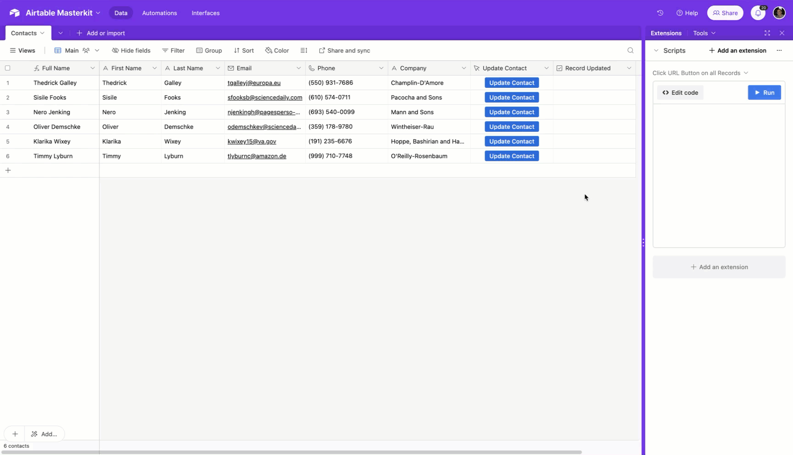

# Click a URL Button on All Records

This script fetches records from the 'Contacts' table in an Airtable base. For each record, if an 'Update Contact' button with a URL is found, a webhook request is triggered.

<div align="center">
    
</div>

## How it Works

1. The script accesses the 'Contacts' table from the current Airtable base.
2. All records from the table are fetched.
3. The script retrieves the webhook URL associated with the 'Update Contact' button for each record.
4. If the URL exists, a request is sent to this webhook URL.

**Note:**

- Ensure the 'Update Contact' field in the 'Contacts' table contains valid URLs. The script specifically checks for a button with a URL.
- Error handling is not included in this script. It's recommended to add try-catch blocks or other error-handling mechanisms to handle possible errors, such as network failures or invalid URLs.

## Script

```javascript
const BUTTON_NAME = 'Update Contact'

const table = base.getTable('Contacts')

// Asynchronously fetch all records from the 'Contacts' table
const query = await table.selectRecordsAsync()

// Loop through each record in the fetched records
for (const record of query.records) {
  // Get the 'Update Contact' cell value, which is expected to be an object with a 'url' property
  const buttonUrl = record.getCellValue(BUTTON_NAME).url

  // Send an asynchronous request to the webhook URL
  if (buttonUrl) {
    await remoteFetchAsync(buttonUrl)
  }
}
```
